# Mysql 연결하는 법
- 새로운 db 생성하기
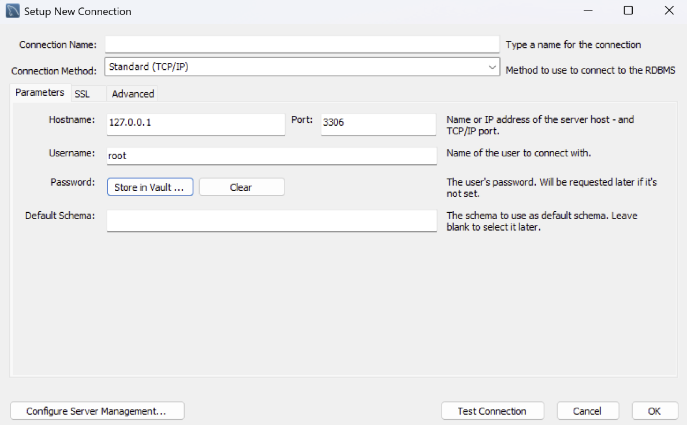

- Stroe in Vault 누르고 비밀번호 입력하기
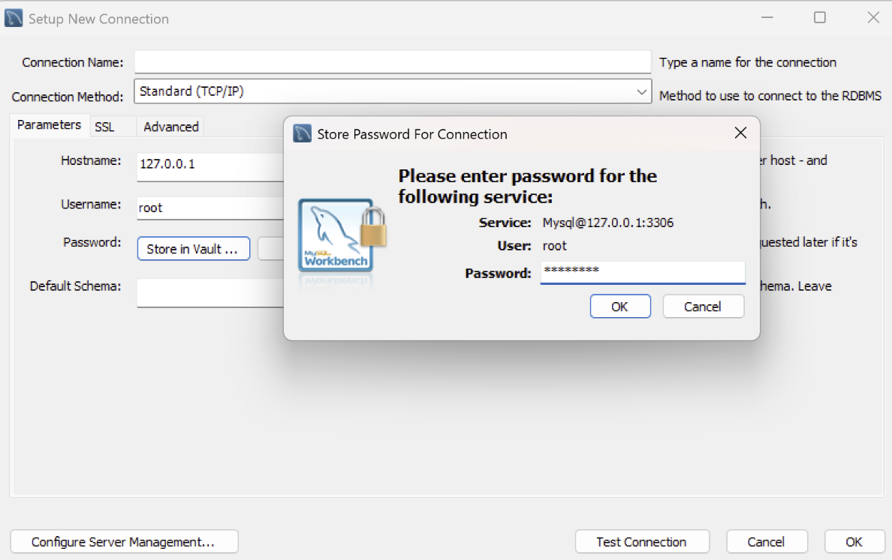

- Test Connection 하고 successful 뭐시기 뜨면 완료
- OK 누르고 설정 완료

**Spring boot에서**
- 종속성 추가
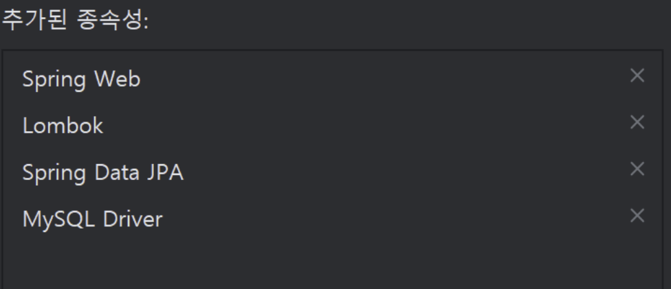

- yaml 파일을 git에 올리지 않도록 설정
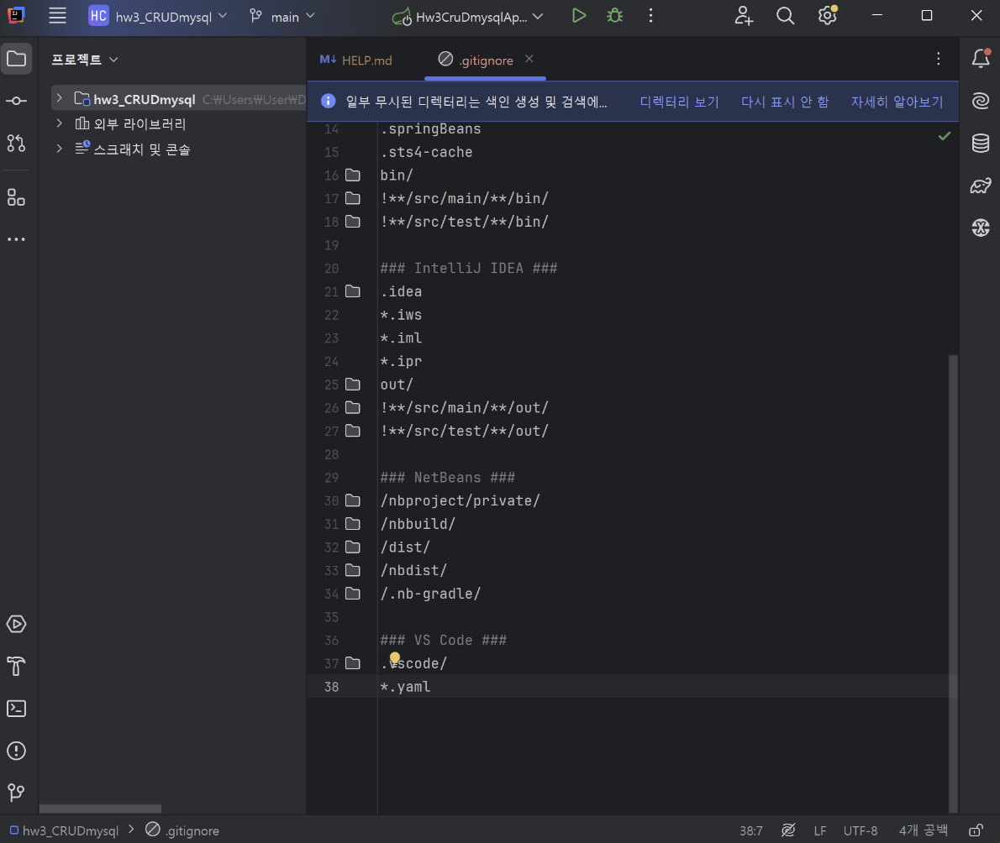

- gitignore 파일을 먼저 푸시 해야지만 yaml 파일이 git에 올라가는 것을 방지할 수 있음
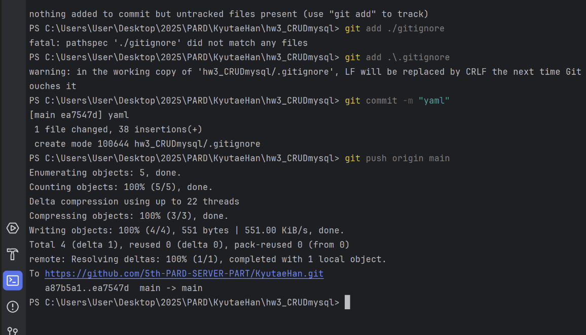

- resources 파일에 있는 application.properties를 application.yaml파일로 변경
- 편의성을 위함이다.
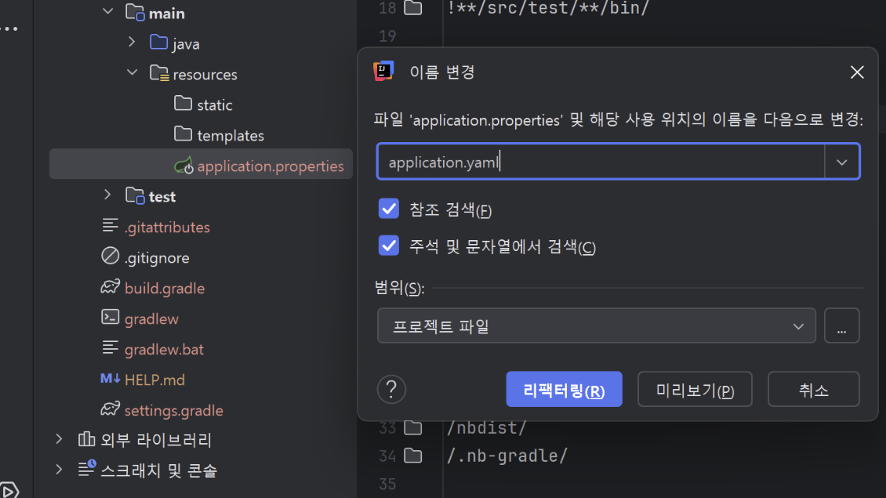

- yaml파일 수정
``` yaml
  
spring:  
  application:  
    name: hw3_CRUDmysql 
  
  datasource:  
    driver-class-name: com.mysql.cj.jdbc.Driver  
    url: jdbc:mysql://localhost:3306/my_crud?serverTimezone=UTC&characterEncoding=UTF-8  
    username: root  
    password: *****  
  
  web:  
    cors:  
      allowed-origins: http://localhost:3000  
  
  jpa:  
    show-sql: true  
    database-platform: org.hibernate.dialect.MySQL8Dialect  
    database: mysql  
    hibernate:  
      ddl-auto: update  
    generate-ddl: false  
    properties:  
      hibernate:  
        format_sql: true  
        enable_lazy_load_no_trans: true
```
- 3가지를 바꿔줘야함
1. name
2. url
3. password

- yaml 파일을 수정하였음로 gradle 새로고침(동기화)해주기
- 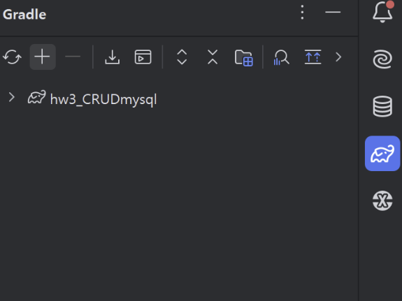

- mysql 불러오기
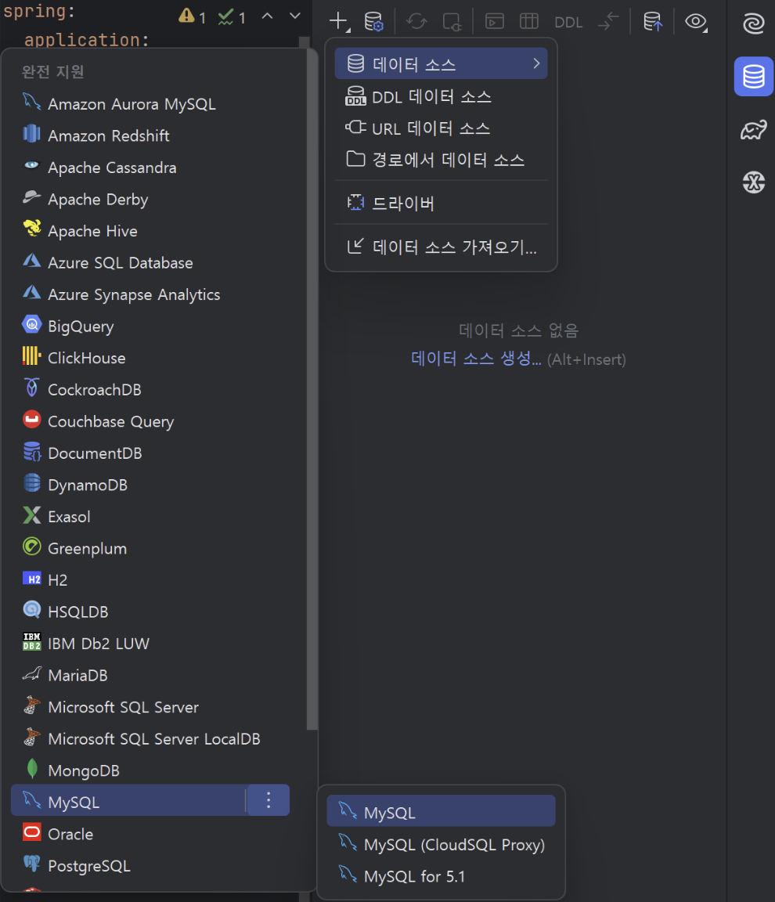

- 사용자에 root
- 비밀번호 입력
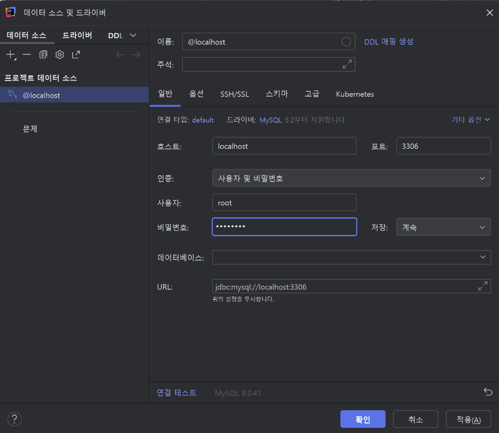

- 연결테스트
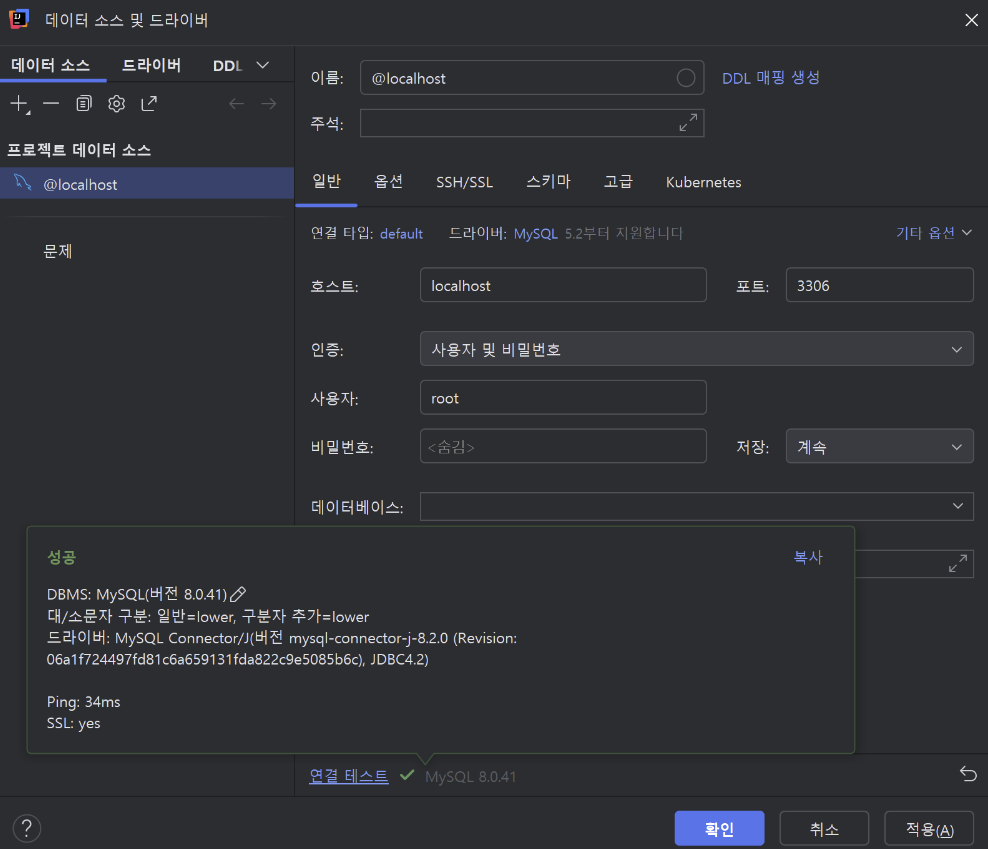

- 쿼리문 작성하고 실행
- 실행 단축키 : ctrl + enter
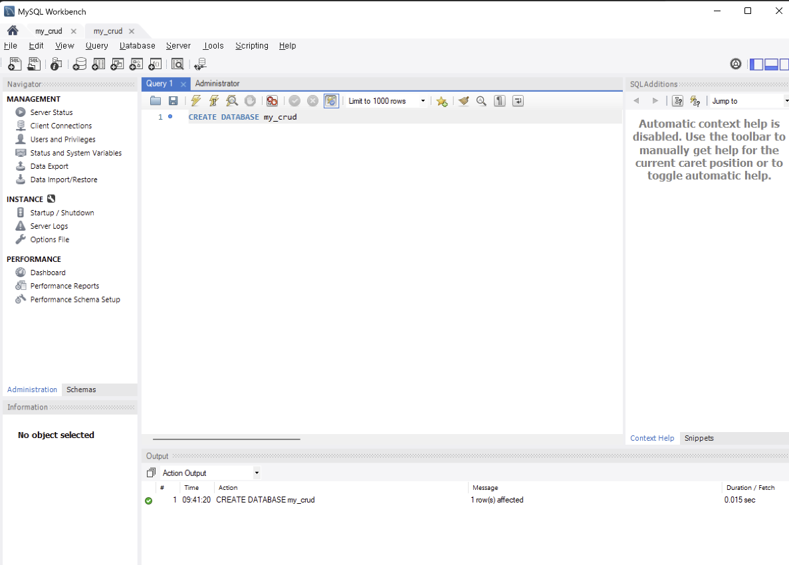

- 새로고침 하고 스키마 선택
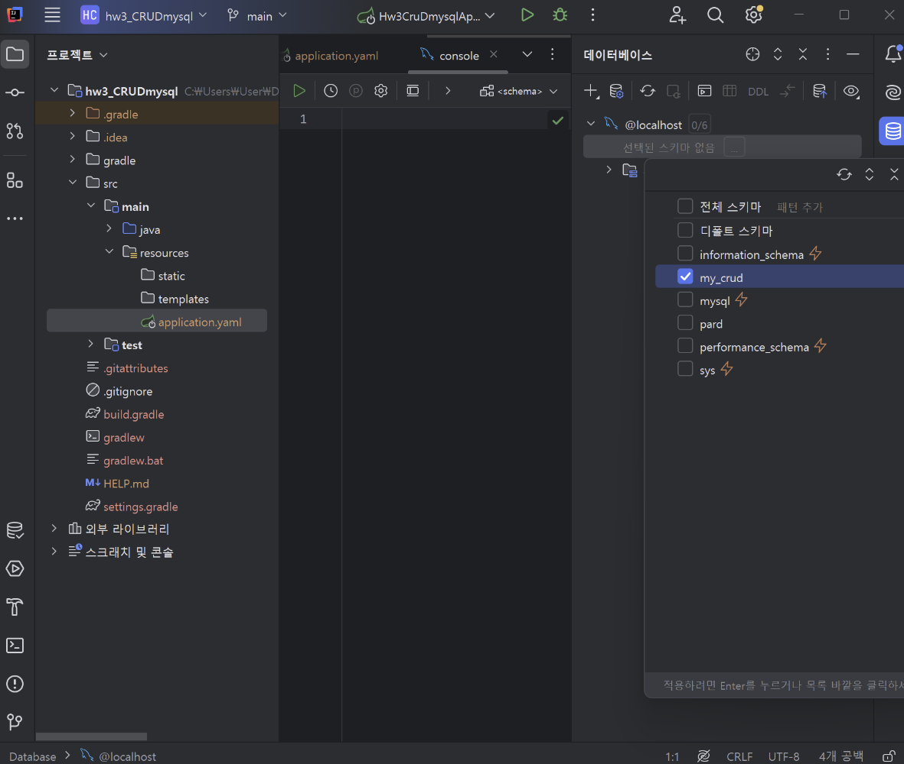