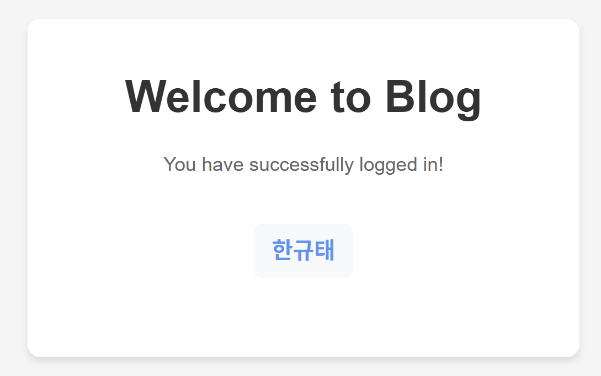

## Swagg!!er
##### 이번 과제는 지난 세미나 때 배운 swagger를 이용해서 코드를 실행해보자

<p align = "center"></p>

---

##### 우선 swagger를 실행하기 위해서는 몇 가지의 사전 준비가 필요하다.

### 1. dependency 추가하기
- 아래 내용을 `build.gradle`의 `dependencies {}` 안에 추가하면 됨!

groovy
`implementation 'org.springdoc:springdoc-openapi-starter-webmvc-ui:2.3.0'`
2. Config 파일 만들기
config 폴더를 만들고 아래처럼 SwaggerConfig.java를 작성해주자!

<p></p>

```java
package com.pard.server.[프로젝트 폴더이름].config;

import io.swagger.v3.oas.models.Components;
import io.swagger.v3.oas.models.OpenAPI;
import io.swagger.v3.oas.models.info.Info;
import io.swagger.v3.oas.models.servers.Server;
import org.springframework.context.annotation.Bean;
import org.springframework.context.annotation.Configuration;

@Configuration
public class SwaggerConfig {

    @Bean
    public OpenAPI openAPI(){
        return new OpenAPI()
                .addServersItem(new Server().url("/"))
                .components(new Components())
                .info(apiInfo());
    }

    private Info apiInfo(){
        return new Info()
                .title("제목")
                .description("설명")
                .version("1.0.0");
    }

    // http://localhost:8080/swagger-ui/index.html
}
```

이렇게 하면 swagger 준비는 끝이야~!
<p align="center"></p>

---

이제 실행을 해보자!
브라우저에 아래 주소를 입력해보자
http://localhost:8080/swagger-ui/index.html

<p align="center"></p>
여기서 모든 API들을 한 번에 테스트할 수 있어!
이제는 Postman 켜고 하나씩 만들 필요 없이 바로바로 실행 가능~

<p align="center"></p>

---

1. 유저와 블로그 생성해보기
user 생성
POST /user → Try it out 클릭

아래처럼 JSON을 입력해보자

``` json
{
  "name": "규태",
  "blogName": "저는 파디입니다"
}
```

<p></p>
결과 확인 (GET /user)

<p></p>

---

2. 같은 유저가 블로그 글을 추가하면?
POST /blog를 이용해서 블로그 글을 추가해보자

<p></p>
결과는 이렇게 나옴

<p>  
 </p>

---

3. 블로그 글을 수정해보자!
PUT /blog/{id}에서 파라미터에 blog ID 입력

JSON으로 수정할 내용 넣기

<p></p>
결과 (GET /user/{id})

<p>  
 </p>

---

4. 글 삭제는?
<p></p>
블로그 글을 지우고 나면 이렇게 정리된다
<p></p>

---

5. 유저를 삭제하면?
<p></p>

과연 결과는 ???

<p align="center"></p>
규태 유저가 사라지면서 그 유저가 쓴 블로그 글들도 전부 삭제됨

<p></p>

---

마무으리~
오늘은 swagger를 써서 연관관계 기반 블로그 서비스를 만들어봤어!
다음엔 좋아요 기능도 넣어서 유저 간 상호작용도 넣어볼 예정 👊

<p align="center"></p>

---
### 2025.05.09 like 추가 및 로그인 기능 추가
2번 유저가 4번 블로그에 좋아요를 눌렀을 경우
<p></p>

결과: 
<p></p>
좋아요가 1개 추가되어음을 확인할 수 있다.

---
만약에 한 번 더 post 요청 즉 **좋아요를 한 번 더 누르게 된다면** 좋아요가 사라지는 것을 확인할 수 있다.
<p></p>

---
### 로그인
<p></p>
지피티 형님의 도움으로 로그인 창 html로 작성하였다.

---

구글로 로그인을 해보자
<p></p>
옳바르게 구글로 연동되며 구글 아이디로 로그인 할 수 있는 것을 확인할 수 있다.

---

로그인을 하면 구글에 설정되어 있는 이름으로 나타나는 것을 확인할 수 있다.
<p></p>