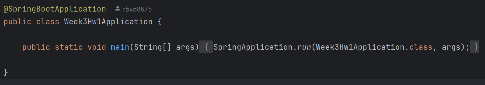
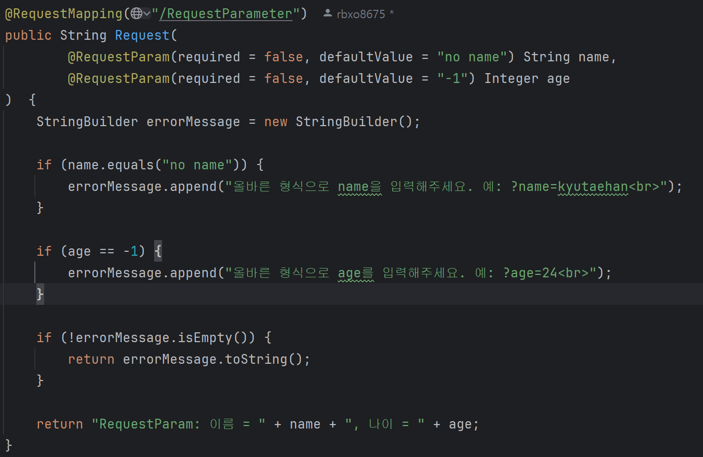
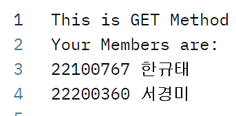
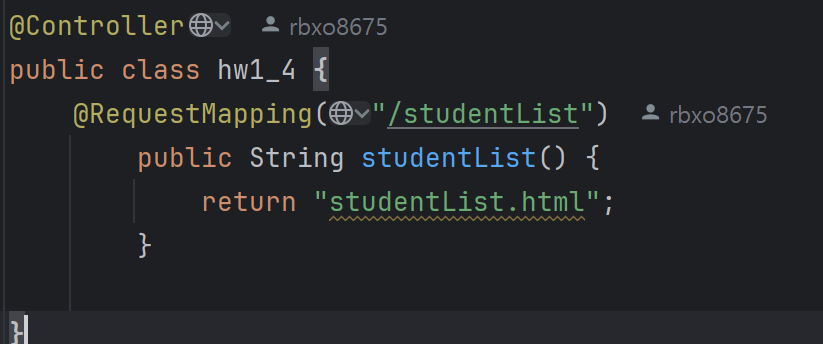
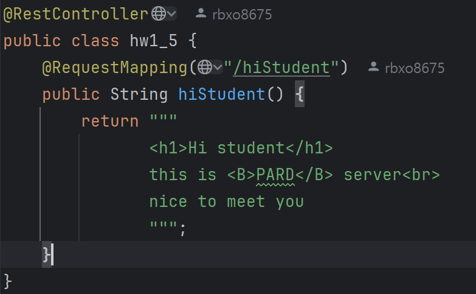

# 📂 Controller 종류 및 예제 정리

**✅ 사용된 컨트롤러 종류:**  
- `@RestController`: `hw1`, `hw1_2`, `hw1_3`, `hw1_5`  
- `@Controller`: `hw1_4`

---

## 📄 hw1.java

- **기능:** URL의 Path Variable을 이용해 이름과 학번을 동적으로 입력받음
- **컨트롤러:** `@RestController`
- **예시 URL:**  
  ```
  http://localhost:8081/path/kyutae/22100767
  ```

- **출력 화면:**
  

---

## 📄 hw1_2.java

- **기능:** Request Parameter 방식으로 `name`, `age`를 입력받음
- **컨트롤러:** `@RestController`
- **예시 URL:**

  - 파라미터 없음 → 오류 출력  
    ```
    http://localhost:8081/RequestParameter
    ```
    

  - name만 입력  
    ```
    http://localhost:8081/RequestParameter?name=kyutae
    ```
    

  - 모든 파라미터 입력  
    ```
    http://localhost:8081/RequestParameter?name=kyutae&age=24
    ```
    

---

## 📄 hw1_3.java
```java
//RestMethod
@RestController
public class hw1_3 {
    @GetMapping("/getUsers")
    public String getUsers() {
        return """
                This is GET Method
                Your Members are:
                22100767 한규태
                22200360 서경미
                """;
    }

    @PostMapping("/post")
    public String postUser() {
        return "add user";
    }

    @PutMapping("/put")
    public String putUser() {
        return "Edit the whole information of the user";
    }

    //@RequestMapping(value = "/head", method = RequestMethod.HEAD)
    @GetMapping("/head")
    public String headUser() {
        return "This is similar to the GET method, but it returns only the header information without the body.";
    }

    @GetMapping("/options")
    public String optionsUser() {
        return """
                Your available methods are:
                Get : (url/getUsers)
                Get : (url/get/{userId})
                Head : (url/head)
                Post : (url/post)
                Put : (url/put)
                Patch : (url/patch/{userId})
                Delete : (url/delete/{userId})
                Options : (url/options)
                """;
    }
}
```
- **기능:** 다양한 HTTP 메서드(GET, POST, PUT, PATCH, DELETE, OPTIONS 등)를 처리하는 API 구현
- **컨트롤러:** `@RestController`

- **특징:**
  - `@GetMapping`, `@PostMapping`, `@PutMapping`, `@PatchMapping`, `@DeleteMapping` 등 REST 방식 사용
  - `/head`, `/options`는 `GET` 방식으로 동작 설명만 구현

- **예시 출력:**
  1. GET 요청  
       
     

  2. PATCH, DELETE 등  
       
       
       
     

---

## 📄 hw1_4.java

- **기능:** `/studentList` 경로로 접근 시 정적 HTML 파일(studentList.html)을 반환
- **컨트롤러:** `@Controller`
- **예시 URL:**  
  ```
  http://localhost:8081/studentList
  ```
- **출력 화면:**  
  

---

## 📄 hw1_5.java

- **기능:** 정적인 파일이 아닌, 경로 자체가 API 응답을 반환하는 Rest API
- **컨트롤러:** `@RestController`
- **예시 URL:**  
  ```
  http://localhost:8081/hiStudent
  ```

- **출력 화면:**  
  

