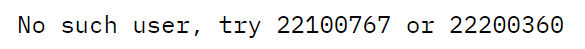
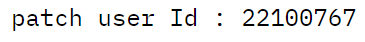
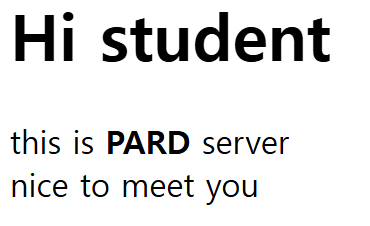

#controller

**컨트롤러의 종류:**

RestController (hw 1,2,3,5)
controller (hw4)


## hw1.java file

path variable을 사용하여서 이름과 학번을 입력 받는 동작
RestController를 사용하여서 경로를 입력하는 url 창에서 동적으로 받아들일 수 있도록 함

출력예시
url 입력창: `http://localhost:8081/path/kyutae/22100767`


---

## hw1_2.java file

Request parameter 형식으로 변수를 받아들이도록 함

출력예시
url 입력창 : `http://localhost:8081/RequestParameter`

파라미터가 없는 경우 오류 메세지를 출력하도록 함

url 입력창 : `http://localhost:8081/RequestParameter?name=kyutae`

하나만 입력한 경우 또다른 파라미터 값을 요구함

url 입력창 : `http://localhost:8081/RequestParameter?name=kyutae&age=24`

모든 파라미터를 입력한 경우에만 입력한 값 리턴

---

## hw1_3.java file
```java
//RestMethod
@RestController
public class hw1_3 {
    @GetMapping("/getUsers")
    public String getUsers() {
        return """
                This is GET Method
                Your Members are:
                22100767 한규태
                22200360 서경미
                """;
    }

    @PostMapping("/post")
    public String postUser() {
        return "add user";
    }

    @PutMapping("/put")
    public String putUser() {
        return "Edit the whole information of the user";
    }

    //@RequestMapping(value = "/head", method = RequestMethod.HEAD)
    @GetMapping("/head")
    public String headUser() {
        return "This is similar to the GET method, but it returns only the header information without the body.";
    }

    @GetMapping("/options")
    public String optionsUser() {
        return """
                Your available methods are:
                Get : (url/getUsers)
                Get : (url/get/{userId})
                Head : (url/head)
                Post : (url/post)
                Put : (url/put)
                Patch : (url/patch/{userId})
                Delete : (url/delete/{userId})
                Options : (url/options)
                """;
    }


    @GetMapping("/get/{userId}")
    public String getUser(@PathVariable Integer userId) {
        if (userId.equals(22100767)) {
            return "userId : " + userId + " 한규태 학생입니다.";
        } else if (userId.equals(22200360)) {
            return "userId : " + userId + " 서경미 학생입니다.";
        } else {
            return "No such user, try 22100767 or 22200360";
        }

    }

    @PatchMapping("/patch/{userId}")
    public String patchUser(@PathVariable Integer userId) {
        if (userId.equals(22100767) || userId.equals(22200360)) {
            return "patch user Id : " + userId;
        } else {
            return "No such user, try 22100767 or 22200360";
        }
    }

    @DeleteMapping("/delete/{userId}")
    public String deleteUser(@PathVariable Long userId) {
        return "Delete UserId : " + userId;
    }
}
```
Request Method를 구현하였으며 head와 options method는 get 방식으로 구현을 하였다.

출력예시
1)


2)






---
## hw1_4.java file

/studentList 라는 경로로 url을 입력하게 되면 studentList.html을 실행하도록 동작

출력예시
url 입력창 : `http://localhost:8081/studentList`


---

## hw1_5.java file

Rest controller
정적인 파일을 불러오는 것이 아닌 경로 자체로 연결을 했을 때에 동작을 수행

출력예시
url 입력창 : `http://localhost:8081/hiStudent`

